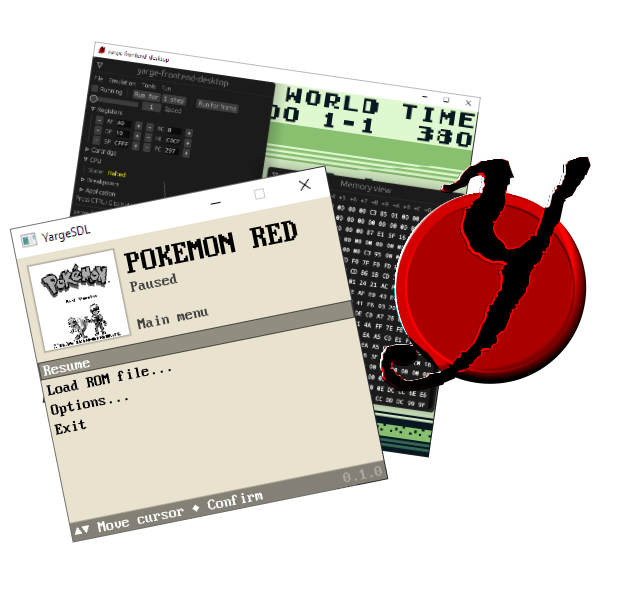

<!--TITLE-->
<h2 align="center">
  
  <code>yarge</code> - <b>y</b>et <b>a</b>nother <b>r</b>ust <b>g</b>ameboy <b>e</b>mulator 
</h2>
<!--BADGES-->

  
  <!--  -->
  

<!--IMAGE-->

<!-- --> <!--This prevents the text from getting too thin -->
<!--DESCRIPTION-->

  <b>Yarge</b>&#160;is&#160;an&#160;open&#160;source (licensed&#160;under&#160;LGPL) Nintendo&#160;Gameboy&#160;emulator written in Rust and focused on accuracy and performance. It includes cycle-accurate emulation of the GBZ80 CPU and PPU FIFO. The emulator is built on a modular architecture, isolating the core from frontends (which can be used as a regular Rust library). 
  SDL2 frontend is fully-featured with intuitive UI and various quality-of-life features such as save slots.
   

<!--DOWNLOADS-->
<h1>Download</h1>

  <table>
    <tr>
      <th align="center">Product</th>
      <th align="center">Downloads</th>
    </tr>
    <tr>
      <td>yarge-frontend-sdl</td>
      <td align="center">
        
        
        
      </td>
    </tr>
    <tr>
      <td>yarge-frontend-desktop <i>(deprecated)</i></td>
      <td align="center">
        
        
        
    </tr>
  </table>
  <i><code>yarge-frontend-desktop</code> is no longer actively maintained, but I'm keeping it around because it's debugging capabilities are still much better then those in <code>yarge-frontend-sdl</code></i>
  <h3>Other options:</h3>
  <ul>
    <li>
      <i><a href="https://github.com/griffi-gh/yarge/tree/master/yarge-core">
        Want to use Yarge as a library in your Rust application?
      </a></i>
    </li>
    <li>
      <a href="https://matsked.netlify.app/yarge-deprecated/">yarge-frontend-nano builds</a>
      (deprecated; does not represent current state of the project)
    </li>
  </ul>

<!--SCREENSHOTS-->
<h1>Screenshots</h1>

  <table>
    <tr>
      <th align="center">Pocket Monsters: Green</th>
      <th align="center">Super Mario Land</th>
    </tr>
    <tr>
      <td align="center">
        
      </td>
      <td align="center">
        
      </td>
    </tr>
    <tr>
      <th align="center">Tetris</th>
      <th align="center">The Legend of Zelda: Link's Awakening</th>
    </tr>
    <tr>
      <td align="center">
        
      </td>
      <td align="center">
        
      </td>
    </tr>
  </table>

<!--SUPPORT-->
<h1>Features</h1>

  <table>
    <tr>
      <th align="center" colspan="2">Features</th>
      <th align="center" colspan="2">MBC (Cartridge) types</th>
    </tr>
    <tr>
      <th align="center">Feature</th>
      <th align="center">Supported</th>
      <th align="center">Type</th>
      <th align="center">Supported</th>
    </tr>
    <tr>
      <td>Display (PPU)</td>
      <td align="center">✔️</td>
      <td>ROM ONLY</td>
      <td align="center">✔️</td>
    </tr>
    <tr>
      <td>Input</td>
      <td align="center">✔️</td>
      <td>MBC1</td>
      <td align="center">✔️</td>
    </tr>
    <tr>
      <td>Sound (APU)</td>
      <td align="center">✔️(WIP)</td>
      <td>MBC2</td>
      <td align="center">❌</td>
    </tr>
    <tr>
      <td>Link cable/Serial</td>
      <td align="center">❌(STUB)</td>
      <td>MBC3</td>
      <td align="center">✔️</td>
    </tr>
    <tr>
      <td>GBC support</td>
      <td align="center">❌</td>
      <td>MBC5</td>
      <td align="center">❌</td>
    </tr>
    <tr>
      <td>Cartridge</td>
      <td align="center">➡️</td>
      <td>MBC6</td>
      <td align="center">❌</td>
    </tr>
    <tr>
      <td colspan="2"></td>
      <td>MBC7</td>
      <td align="center">❌</td>
    </tr>
    <tr>
      <td colspan="2"></td>
      <td>MMM01</td>
      <td align="center">❌</td>
    </tr>
    <tr>
      <td colspan="2"></td>
      <td>POCKET CAMERA</td>
      <td align="center">❌</td>
    </tr>
    <tr>
      <td colspan="2"></td>
      <td>BANDAI TAMA5</td>
      <td align="center">❌</td>
    </tr>
    <tr>
      <td colspan="2"></td>
      <td>HuC3</td>
      <td align="center">❌</td>
    </tr>
    <tr>
      <td colspan="2"></td>
      <td>HuC1</td>
      <td align="center">❌</td>
    </tr>
  </table>

<!--TEST TABLE-->
<h1>Tests</h1>

<i>These tests are run automatically after each commit.</i>

  ___TEST_TABLE___

