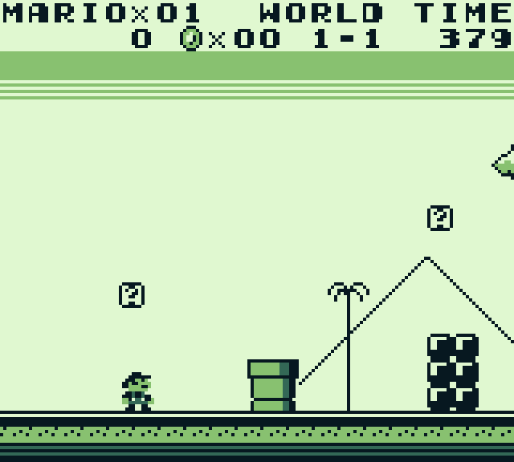
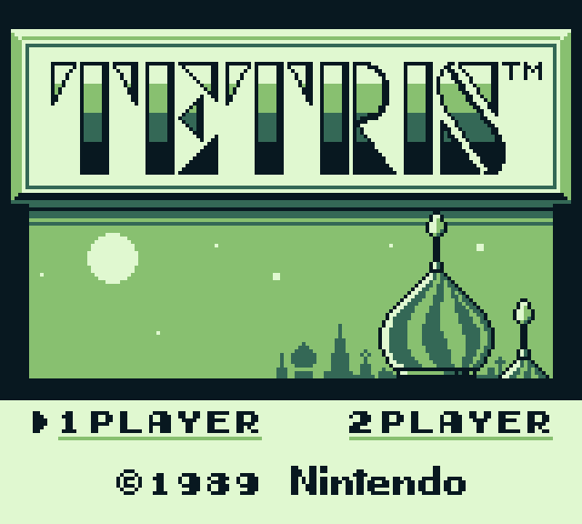
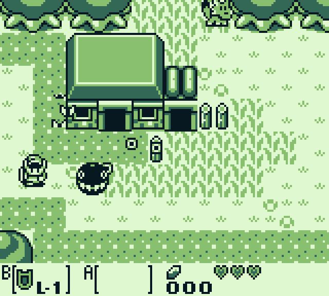

<!--TITLE-->
<h2 align="center">
  
  <code>yarge</code> - <b>y</b>et <b>a</b>nother <b>r</b>ust <b>g</b>ameboy <b>e</b>mulator 
</h2>
<!--BADGES-->

  
  
  

  <i>TODO:</i> Lorem ipsum dolor sit amet, consectetur adipiscing elit, sed do eiusmod tempor incididunt ut labore et dolore magna aliqua. Ut enim ad minim veniam, quis nostrud exercitation ullamco laboris nisi ut aliquip ex ea commodo consequat. Duis aute irure dolor in reprehenderit in voluptate velit esse cillum dolore eu fugiat nulla pariatur. Excepteur sint occaecat cupidatat non proident, sunt in culpa qui officia deserunt mollit anim id est laborum.

<h1>Download</h1>

  <table>
    <tr>
      <th align="center">Product</th>
      <th align="center">Downloads</th>
    </tr>
    <tr>
      <td>
        yarge-frontend-desktop
      </td>
      <td align="center">
        
        
        
        <!--  -->
      </td>
    </tr>
    <tr>
      <td>
        yarge-frontend-nano
      </td>
      <td align="center">
        
        
      </td>
    </tr>
  </table>
  <i><a href="https://github.com/griffi-gh/yarge/tree/master/yarge-core">
    Want to use Yarge as a library in your Rust application?
  </a></i>

<h1>Screenshots</h1>

  <table>
    <tr>
      <th align="center">Pocket Monsters: Green</th>
      <th align="center">Super Mario Land</th>
    </tr>
    <tr>
      <td align="center">
        
      </td>
      <td align="center">
        
      </td>
    </tr>
    <tr>
      <th align="center">Tetris</th>
      <th align="center">The Legend of Zelda: Link's Awakening</th>
    </tr>
    <tr>
      <td align="center">
        
      </td>
      <td align="center">
        
      </td>
    </tr>
  </table>

<h1>Support</h1>

  <table>
    <tr>
      <th align="center" colspan="2">MBC Support</th>
      <th align="center" colspan="2">Features</th>
    </tr>
    <tr>
      <th align="center">Type</th>
      <th align="center">Support</th>
      <th align="center">Feature</th>
      <th align="center">Support</th>
    </tr>
    <tr>
      <td>ROM ONLY</td>
      <td align="center">✔️</td>
      <td>Display (PPU)</td>
      <td align="center">✔️</td>
    </tr>
    <tr>
      <td>MBC1</td>
      <td align="center">✔️</td>
      <td>Input</td>
      <td align="center">✔️</td>
    </tr>
    <tr>
      <td>MBC2</td>
      <td align="center">❌</td>
      <td>Sound (APU)</td>
      <td align="center">(WIP)</td>
    </tr>
    <tr>
      <td>MBC3</td>
      <td align="center">✔️</td>
      <td>Link cable/Serial</td>
      <td align="center">❌</td>
    </tr>
    <tr>
      <td>MBC5</td>
      <td align="center">❌</td>
      <td>GBC support</td>
      <td align="center">❌</td>
    </tr>
    <tr>
      <td>MBC6</td>
      <td align="center">❌</td>
      <td colspan="2"></td>
    </tr>
    <tr>
      <td>MBC7</td>
      <td align="center">❌</td>
      <td colspan="2"></td>
    </tr>
    <tr>
      <td>MMM01</td>
      <td align="center">❌</td>
      <td colspan="2"></td>
    </tr>
    <tr>
      <td>POCKET CAMERA</td>
      <td align="center">❌</td>
      <td colspan="2"></td>
    </tr>
    <tr>
      <td>BANDAI TAMA5</td>
      <td align="center">❌</td>
      <td colspan="2"></td>
    </tr>
    <tr>
      <td>HuC3</td>
      <td align="center">❌</td>
      <td colspan="2"></td>
    </tr>
    <tr>
      <td>HuC1</td>
      <td align="center">❌</td>
      <td colspan="2"></td>
    </tr>
  </table>

<h1>Tests</h1>

<i>These tests are run automatically after each commit.</i>

  ___TEST_TABLE___

